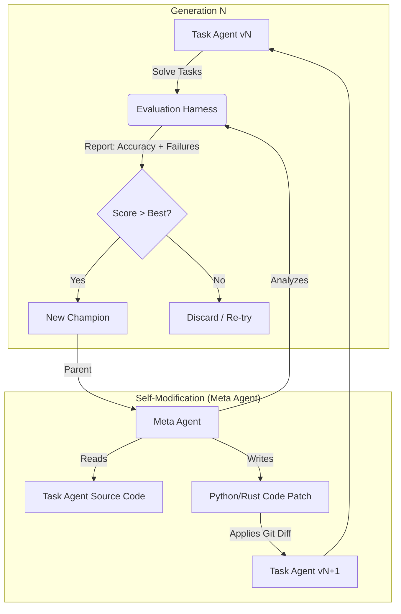
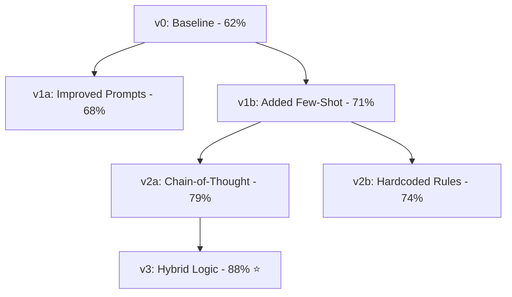
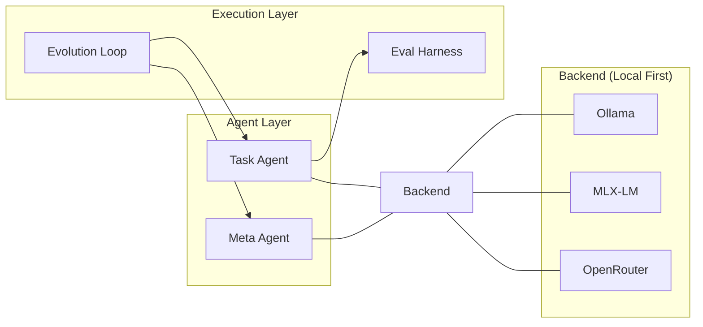

# 🧬 HyperAgents-Ollama (Proposed: **Recurse-Local** 🌀)

**Self-Improving AI Agents — Local, Cloud, or Free**

A fork of [facebookresearch/HyperAgents](https://github.com/facebookresearch/HyperAgents) extended with local Ollama, Apple Silicon MLX, OpenRouter cloud gateway, and a Rust port of the evolution loop.

> **Paper:** [Hyperagents](https://arxiv.org/abs/2603.19461) — Self-referential agents that integrate a task agent and a meta agent into a single editable program, enabling metacognitive self-modification.

---

## 🌀 How it Works: The Meta-Loop

The core of the project is a self-referential cycle where the agent literally rewrites its own brain to become better at a specific task.

### 1. The Evolution Cycle


### 3. Lineage Tree (Example)
The system maintains a "Tree of Life" for your agents. Only the strongest versions survive to seed the next generation.



### 2. System Architecture


---

## 🏷️ Rebranding Research

We are looking for a new name that captures the **Local** and **Recursive** nature of the framework. Here are some candidates:

| Name | Theme | Why it works |
|---|---|---|
| **Recurse** | Technical | Directly describes the self-referential code-writing loop. |
| **Ouro** | Mythological | Short for Ouroboros (the snake eating its tail), a symbol of recursion. |
| **Helix** | Biological | Represents the DNA-like code structure and evolution. |
| **Forge-Local** | Industrial | Focuses on the "Forging" of better agents on your own hardware. |
| **Loom** | Craft | Weaving better logic into the agent's source code. |

---

## How it works (Original)

```
┌─────────────────────────────────────────────────────────┐
│  Hyper Loop                                             │
│                                                         │
│  Gen 0:  TaskAgent solves tasks  →  baseline score      │
│                                                         │
│  Gen N:  MetaAgent (expert) reads:                      │
│            • task_agent.py source code                  │
│            • failure cases from last eval               │
│            • previous patch history                     │
│          → rewrites task_agent.py                       │
│          TaskAgent (new version) → new score            │
│          Best score survives, tree grows                │
└─────────────────────────────────────────────────────────┘
```

- **Task Agent** (`task_agent.py`) — solves domain tasks with Chain-of-Thought reasoning
- **Meta Agent** (`meta_agent.py`) — studies failures and rewrites the Task Agent's code
- **Evolution Loop** — iterates for N generations, selecting the best-scoring lineage

---

## Setup

```bash
git clone <repo>
cd HyperAgents-Ollama
python -m venv venv && source venv/bin/activate
pip install -r requirements_local.txt

cp .env.example .env
# edit .env — see Configuration section below
```

---

## Configuration (`.env`)

```bash
# ── Local Ollama ──────────────────────────────────────
OLLAMA_BASE_URL=http://localhost:11434
MODEL_NAME=ollama/gemma4:e4b        # any model you have pulled
MAX_TOKENS=4096

# ── Apple Silicon (MLX) ──────────────────────────────
# MODEL_NAME=mlx/BeastCode/Qwen3.5-27B-Claude-4.6-Opus-Distilled-MLX-4bit
# MLX_MODEL_PATH=/path/to/local/weights   # optional local override

# ── OpenRouter (300+ models, many free) ──────────────
# OPENROUTER_API_KEY=sk-or-...
# MODEL_NAME=openrouter/google/gemma-3-4b-it:free
```

### OpenRouter free models

| Model | `MODEL_NAME` |
|---|---|
| Gemma 3 4B | `openrouter/google/gemma-3-4b-it:free` |
| Llama 4 Scout | `openrouter/meta-llama/llama-4-scout:free` |
| Qwen3 8B | `openrouter/qwen/qwen3-8b:free` |
| DeepSeek R1 | `openrouter/deepseek/deepseek-r1-0528:free` |
| Claude Sonnet | `openrouter/anthropic/claude-sonnet-4-5` |

---

## Python — Running the hyper loop

### Quick start (absolute paths, from anywhere)

```bash
# Ollama (local) — factory domain
cd /Users/nick/development/TEMP/HyperAgents-Ollama && python generate_loop_local.py --domain factory --model ollama/gemma4:e4b --max-generation 8 --num-workers 3 --verbose

# Ollama (local) — rust domain
cd /Users/nick/development/TEMP/HyperAgents-Ollama && python generate_loop_local.py --domain rust --model ollama/gemma4:e4b --max-generation 8 --num-workers 3 --verbose

# OpenRouter — Gemma 3 4B (free, 20 req/min limit → num-workers 1)
cd /Users/nick/development/TEMP/HyperAgents-Ollama && python generate_loop_local.py --domain factory --model openrouter/google/gemma-3-4b-it:free --max-generation 8 --num-workers 1 --verbose

# OpenRouter — Qwen3 8B (free, 20 req/min limit → num-workers 1)
cd /Users/nick/development/TEMP/HyperAgents-Ollama && python generate_loop_local.py --domain factory --model openrouter/qwen/qwen3-8b:free --max-generation 8 --num-workers 1 --verbose

# Apple Silicon MLX
cd /Users/nick/development/TEMP/HyperAgents-Ollama && python generate_loop_local.py --domain factory --model mlx/BeastCode/Qwen3.5-27B-Claude-4.6-Opus-Distilled-MLX-4bit --max-generation 5
```

### All options

```
python generate_loop_local.py [OPTIONS]

  --domain           {text_classify, search_arena, paper_review, rust, factory}
  --model            Model string (ollama/*, openrouter/*, mlx/*)
  --max-generation   Number of evolution generations  [default: 5]
  --num-samples      Samples per eval, -1 for all     [default: -1]
  --num-workers      Parallel eval threads            [default: 4]
  --parent-selection {best, latest, proportional}     [default: best]
  --output-dir       Where to write results           [default: ./outputs_local]
  --verbose / -v     Stream all subprocess output live
```

### Recommended run (3 terminals)

**Terminal 1 — run**
```bash
cd /Users/nick/development/TEMP/HyperAgents-Ollama && python generate_loop_local.py --domain rust --model openrouter/google/gemma-3-4b-it:free --max-generation 8 --num-samples 20 --num-workers 3 --parent-selection best --verbose > /tmp/hyperloop.log 2>&1
```

**Terminal 2 — live log**
```bash
tail -f /tmp/hyperloop.log
```

**Terminal 3 — score graph**
```bash
watch -n3 '
LATEST=$(ls outputs_local/ | sort | tail -1)
echo "Run: $LATEST"
cat outputs_local/$LATEST/archive.jsonl 2>/dev/null \
  | python3 -c "
import sys, json
for line in sys.stdin:
    r = json.loads(line)
    bar = \"#\" * int(r.get(\"score\",0)*30)
    print(f\"  Gen {r[\"gen\"]:>2}  {r.get(\"score\",0):.3f}  {bar}\")
" || echo "  waiting for gen 0..."
'
```

---

## Rust — Running the hyper loop

The `rust/` directory is a native Rust port of the same evolution loop, using Rayon for parallelism and Reqwest for HTTP.

### Build

```bash
cd /Users/nick/development/TEMP/HyperAgents-Ollama/rust
cargo build --release
# binary lands at: rust/target/release/hyperagents
```

### Run (absolute paths, from anywhere)

```bash
# Ollama (local) — factory domain (hardest)
/Users/nick/development/TEMP/HyperAgents-Ollama/rust/target/release/hyperagents --domain factory --model ollama/qwen2.5-coder:7b --max-generation 8 --num-workers 4 --parent-selection best --verbose

# Ollama (local) — emotion domain
/Users/nick/development/TEMP/HyperAgents-Ollama/rust/target/release/hyperagents --domain emotion --model ollama/qwen2.5-coder:7b --max-generation 8 --num-workers 4 --parent-selection best --verbose

# OpenRouter — Gemma 3 4B (free, 20 req/min limit → num-workers 1)
/Users/nick/development/TEMP/HyperAgents-Ollama/rust/target/release/hyperagents --domain factory --model openrouter/google/gemma-3-4b-it:free --max-generation 8 --num-workers 1 --parent-selection best --verbose

# OpenRouter — Qwen3 8B (free, 20 req/min limit → num-workers 1)
/Users/nick/development/TEMP/HyperAgents-Ollama/rust/target/release/hyperagents --domain factory --model openrouter/qwen/qwen3-8b:free --max-generation 8 --num-workers 1 --verbose

# OpenRouter — DeepSeek R1 (free, reasoning model, num-workers 1)
/Users/nick/development/TEMP/HyperAgents-Ollama/rust/target/release/hyperagents --domain factory --model openrouter/deepseek/deepseek-r1-0528:free --max-generation 5 --num-workers 1 --verbose
```

Or via cargo (cd into rust/ first):

```bash
cd /Users/nick/development/TEMP/HyperAgents-Ollama/rust && cargo run --release -- --domain factory --model openrouter/google/gemma-3-4b-it:free --max-generation 8 --num-workers 1 --parent-selection best --verbose
```

### All Rust options

```
hyperagents [OPTIONS]

  --domain           {text_classify, search_arena, paper_review, emotion, factory}
  --model            Model string (ollama/*, openrouter/*)  [default: ollama/llama3.2]
  --max-generation   Evolution generations                  [default: 5]
  --num-samples      Samples per eval, -1 for all          [default: -1]
  --num-workers      Rayon parallel threads                [default: 4]
  --output-dir       Output directory                       [default: ./outputs_local]
  --parent-selection {best, latest, proportional}          [default: best]
  --verbose / -v     Verbose output
```

> **Note:** The Rust port supports `text_classify`, `search_arena`, `paper_review`, `emotion`, and `factory` domains. The Python version additionally supports `rust` (Rust compiler-error classification).

---

## Domains

| Domain | Labels | Description | Python | Rust |
|---|---|---|:---:|:---:|
| `text_classify` | positive / negative / neutral | Sentiment classification — good baseline | ✓ | ✓ |
| `search_arena` | a / b | Which of two search responses is better | ✓ | ✓ |
| `paper_review` | accept / reject / … | Academic paper outcome prediction | ✓ | ✓ |
| `emotion` | joy / anger / fear / … | Emotion classification | ✓ | ✓ |
| `factory` | expedite / prioritize_urgent / rebalance / batch_production / optimize_throughput | Virtual factory floor dispatch controller — 5-class, rule-based, hardest domain | ✓ | ✓ |
| `rust` | compiles / borrow_error / type_error | Rust compile-error classification | ✓ | — |

---

## Reading the results

All output lands in `outputs_local/run_YYYYMMDD_HHMMSS/`:

```
run_20260414_164911/
├── archive.jsonl          # generation scores + lineage
├── best_task_agent.py     # best evolved agent code
├── gen_initial/           # baseline evaluation
├── gen_1/
│   ├── agent_output/
│   │   ├── meta_agent_chat_history.md   # what the expert thought
│   │   └── model_patch.diff             # the code change it made
│   └── agent_evals/
│       └── chat_history_<id>.md         # per-sample reasoning
└── gen_2/ …
```

```bash
# Final score summary
cat outputs_local/$(ls outputs_local/ | sort | tail -1)/archive.jsonl

# See the patch the meta agent wrote in gen 1
cat outputs_local/$(ls outputs_local/ | sort | tail -1)/gen_1/agent_output/model_patch.diff

# Read the best evolved agent
cat outputs_local/$(ls outputs_local/ | sort | tail -1)/best_task_agent.py
```

---

## Project structure

```
├── generate_loop_local.py    # 🚀 Python evolution loop (main entry point)
├── task_agent.py             # 🔍 Task agent — CoT reasoning, evolves each gen
├── meta_agent.py             # 🧠 Meta agent — reads code + failures, writes patch
├── run_task_agent.py         # Run task agent standalone
├── run_meta_agent.py         # Run meta agent standalone
├── agent/
│   ├── llm.py                # LLM interface: Ollama / MLX / OpenRouter / Cloud
│   ├── llm_withtools.py      # Tool-use loop + fuzzy JSON parser
│   ├── base_agent.py         # Base class
│   └── tools/                # Editor + Bash tools
├── domains/
│   ├── text_classify/        # Sentiment (20 train / 15 val / 15 test)
│   ├── search_arena/         # Search quality comparison
│   ├── paper_review/         # Academic review outcome
│   ├── emotion/              # Emotion classification
│   ├── rust/                 # Rust compile-error classification
│   ├── harness.py            # Parallel evaluation harness
│   └── report.py             # Accuracy + per-label metrics
├── utils/
│   ├── git_utils.py          # Git reset / clean / patch apply
│   └── common.py             # JSON extraction helpers
├── rust/                     # 🦀 Rust port of the evolution loop
│   ├── Cargo.toml
│   └── src/
│       ├── main.rs           # CLI entry point
│       ├── main_loop.rs      # Evolution loop
│       ├── llm.rs            # HTTP LLM client
│       ├── agent/            # Task + Meta agent
│       ├── domains/          # Domain harness + datasets
│       └── tools/            # Editor + Bash tools
├── run_local_isolated.sh     # 🛡️ Safe run in temp directory (macOS/Linux)
├── run_all_benchmarks.sh     # 🎯 Multi-domain benchmark suite
└── .env.example              # Configuration template
```

---

## Citation & License

See the original [HyperAgents paper](https://arxiv.org/abs/2603.19461) and [LICENSE.md](LICENSE.md).
